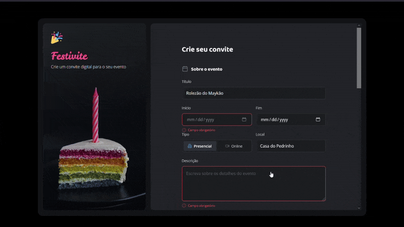

# 📨 Projeto Formulário de Convite 📨
Desafio prático desenvolvido durante Formação Full-Stack promovida pela Rocketseat
___
## 🎉 Layout direcionado para páginas de eventos
  

  
___
### 🤖 Tecnologias e Recursos  
  
* HTML
* CSS
* Git
* Figma
* Notion  

#### 🔎 Você pode conferir o resultado clicando [aqui](https://arturtinoco.github.io/formulario-de-convite/) ou ver o projeto no [Figma](https://www.figma.com/community/file/1389649528880849780) feito por [Millena Martins](https://www.linkedin.com/in/millenamartins/).  